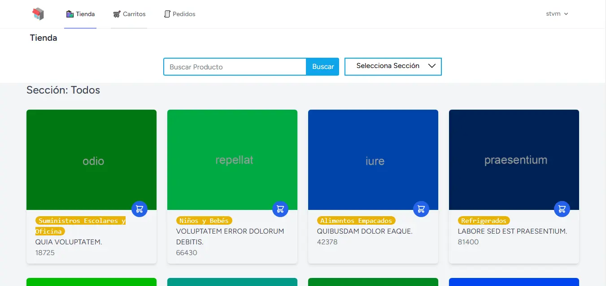
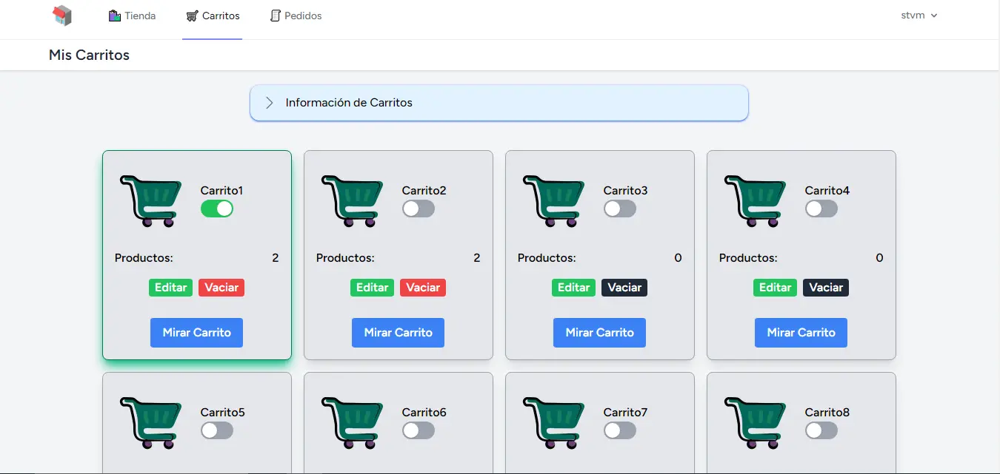
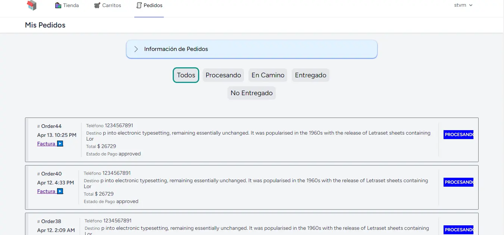
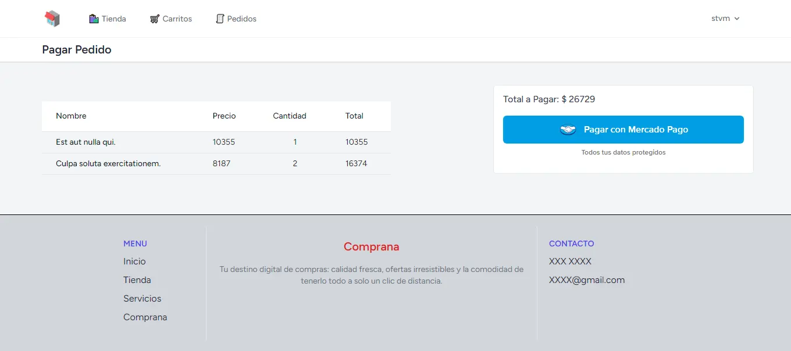
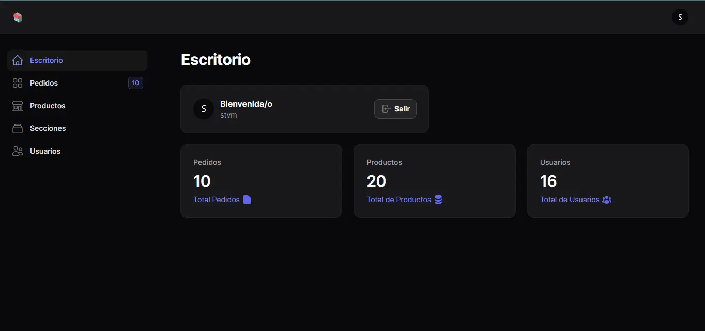
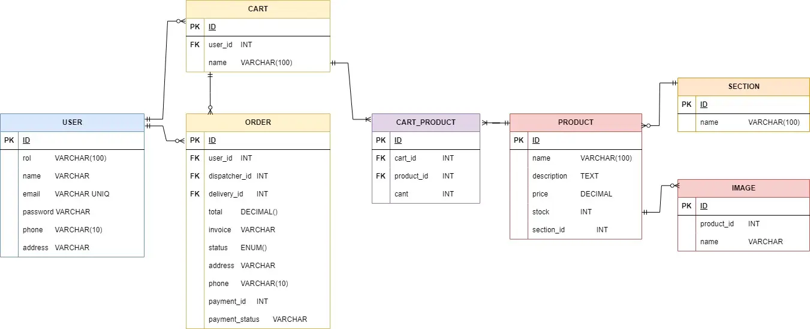

# Comprana

Comprana es una aplicación web monolítica que permite comprar víveres desde casa y recibirlos en la puerta. Ofrece una amplia gama de productos, una interfaz intuitiva para buscar y comprar.

video: https://youtu.be/ZDsoQOYZTCI

## Capturas

| Inicio                              | Tienda                              | Carritos                                |
| ----------------------------------- | ----------------------------------- | --------------------------------------- |
|  |  |  |

| Pedidos                               | Compra                              | Admin                             |
| ------------------------------------- | ----------------------------------- | --------------------------------- |
|  |  |  |

## Tecnologías

| Paquete   | Versión | Notas                  |
|-----------|---------|------------------------|
| PHP       | 8.1.10  | Framework: Laravel 11  |
| Composer  | 2.4.1   |                        |
| Node.js   | 18      | NPM 8.18.0             |
| MySQL     | 8.0.30  |                        |
| Frontend  | -       | Livewire 3, Filament 4, TailwindCSS, Alpine.js |


## Instalación

Así es como puede ejecutar el proyecto localmente:

1. Clonar repositorio

    ```sh
    git clone https://github.com/maycolmunoz/comprana.git
    ```

1. Ingresa al directorio raíz del proyecto

    ```sh
    cd comprana
    ```

1. Copie el archivo .env.example al archivo .env
    ```sh
    cp .env.example .env
    ```
1. Crea base de datos `comprana`

1. Crea enlace simbólico

    ```sh
    php artisan storage:link
    ```

1. Instala dependencias PHP

    ```sh
    composer install
    ```

1. Genera key

    ```sh
    php artisan key:generate
    ```

1. Instala dependencias front-end

    ```sh
    npm install && npm run build
    ```

1. Ejecuta migration
    ```
    php artisan migrate
    ```
1. Ejecuta seeder
    ```
    php artisan db:seed
    ```

## DB


