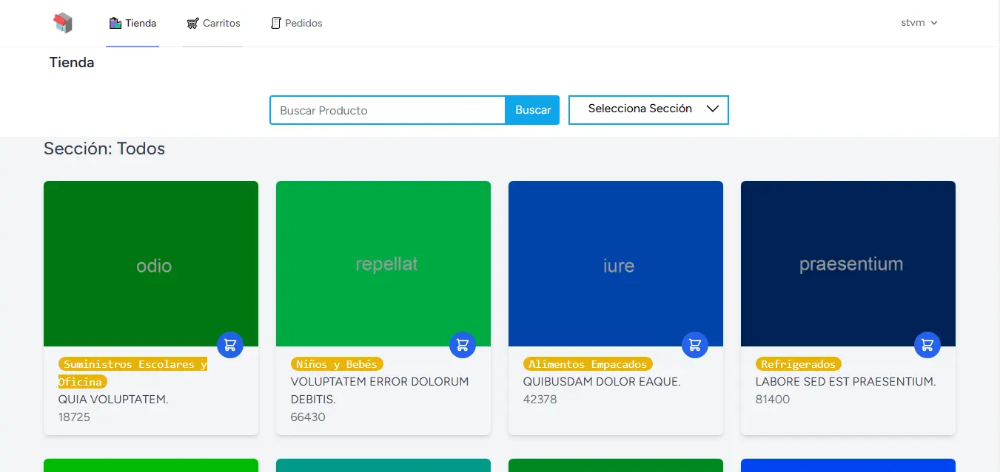
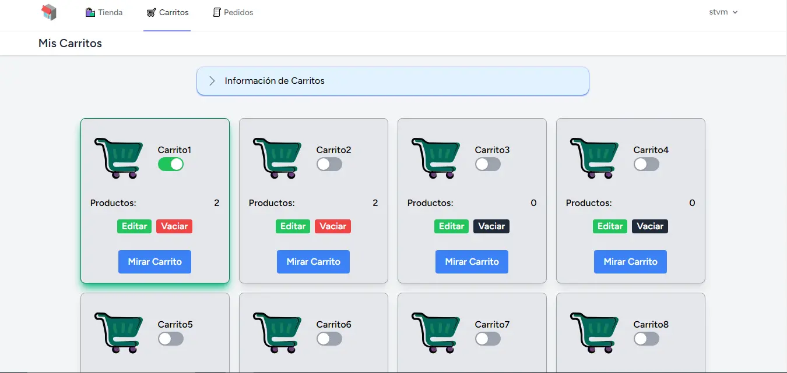
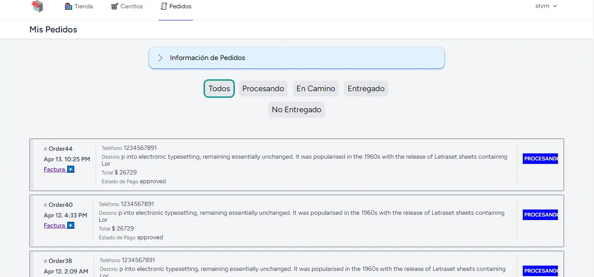
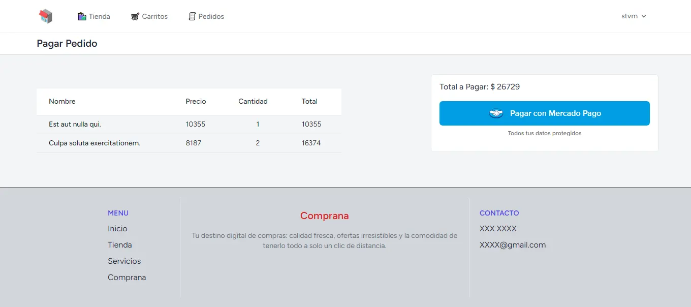
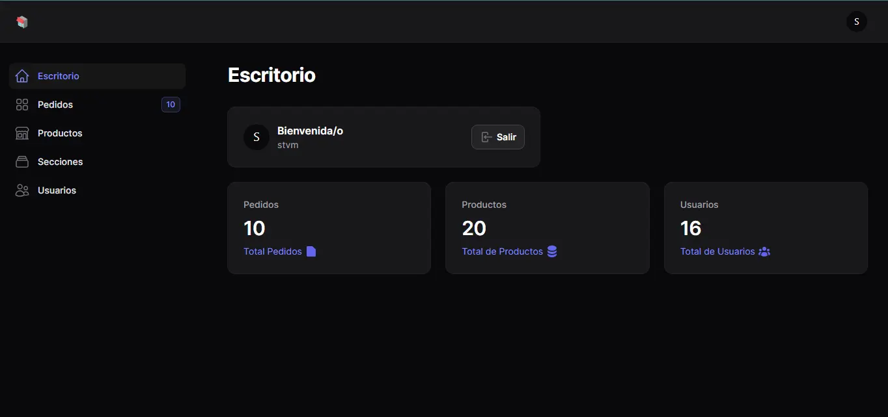

# Comprana 🛒

Comprana es una plataforma de comercio electrónico moderna, diseñada para facilitar la compra de víveres desde casa con entrega a domicilio.

---

## 📸 Capturas de Pantalla

| **Inicio** | **Tienda** | **Carritos** |
| :---: | :---: | :---: |
|  |  |  |

| **Pedidos** | **Compra** | **Panel Admin** |
| :---: | :---: | :---: |
|  |  |  |

---

## 🛠 Stack Tecnológico

Comprana utiliza las tecnologías más recientes del ecosistema Laravel para garantizar rendimiento y mantenibilidad:

*   **Backend**: [Laravel 12](https://laravel.com/) (PHP 8.4+)
*   **Panel Administrativo**: [Filament v5](https://filamentphp.com/)
*   **Frontend Reactivo**: [Livewire v4](https://livewire.laravel.com/) & [Alpine.js v3](https://alpinejs.dev/)
*   **Estilos**: [TailwindCSS v4](https://tailwindcss.com/) & [DaisyUI v5](https://daisyui.com/)
*   **Base de Datos**: MySQL / MariaDB
*   **Facturación**: [FPDF](http://www.fpdf.org/)
*   **Pagos**: [Mercado Pago SDK](https://www.mercadopago.com.mx/developers/es/docs/sdks-library/server-side/php)

---

## 🚀 Características Principales

*   🛍 **Tienda Interactiva**: Catálogo reactivo organizado por secciones con búsqueda instantánea.
*   🛒 **Gestión de Carritos**: Carritos de compra persistentes vinculados a la cuenta del usuario.
*   📦 **Órdenes y Pedidos**: Proceso de checkout fluido con seguimiento de estado.
*   🧾 **Facturación Automática**: Generación de facturas en PDF tras completar la compra.
*   🛡 **Roles y Permisos**: Sistema granular de permisos gestionado mediante [Filament Shield](https://github.com/bezhanSalleh/filament-shield).
*   📧 **Notificaciones**: Avisos por correo electrónico sobre el estado de los pedidos.
*   🛠 **Panel de Administración**: Gestión integral de productos, secciones, usuarios y órdenes.

---

## 📖 Documentación

Explora las guías de instalación y configuración:

*   [📥 Guía de Instalación y Desarrollo](./_docs/installation.md)
*   [🔑 Variables de Entorno](./_docs/installation.md#-variables-de-entorno)
*   [📂 Base de Datos](./_docs/database.md)

---

## 📄 Licencia

Este proyecto está bajo la licencia **MIT**. Consulta el archivo [LICENSE](LICENSE) para más detalles.
